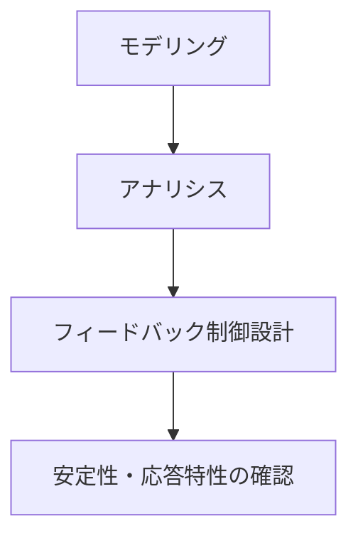
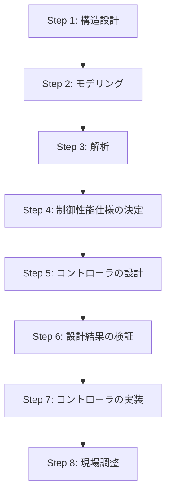

  

  

  

🚀 Obsidian用ノート：制御工学の全体像

第1章 制御工学の全体像

  

## 1.1 制御から連想するものは？

制御 (Control) という言葉を聞いて、何をイメージするだろうか？
制御は以下のような分野で幅広く利用されている。

  

📌 科学・技術分野
• 人工衛星やロケットの姿勢制御・軌道制御
• 自動車のエンジン制御、電気モータ制御
• 二足歩行ロボットの制御
• 原子力発電所の制御システム
• スマートグリッド（電力網）の制御
  
📌 スポーツ分野
• サッカー選手のボールコントロール
• ピッチャーのコントロール（制球）

📌 日常生活
• 自転車が倒れないように運転する
• エアコンで室温を一定に制御する

このように、「制御」は非常に広い分野で活用されている。


> [!abstract] 制御の定義
> 制御とは
> あるシステムの動作を特定の目的に合わせるために操作を加えること。

  
## 1.2 力学系の制御 - フィードバック制御の概観

制御系設計は、大きく 3つのステップ で構成される。
1. モデリング (Modeling)
	• 制御対象の数学モデルを構築する（例: 運動方程式）
2. アナリシス (Analysis)
	• 制御対象の特性（安定性・応答特性）を解析する
3. デザイン (Design)
	• フィードバック制御を設計する

  

制御系設計の流れを以下に示す。


  

  

  
 

### 1.2.1 制御対象のモデリング


📌 [[ニュートンの運動方程式]]

質量 $m$ の物体に力 $f(t)$ を加えた場合、運動方程式は次のように表される。

$$
m \frac{d^2 x(t)}{dt^2} = f(t)
$$
この方程式を[[ラプラス変換]](積分は$\frac{1}{s}$, 微分は$s$)すると、
$$
m s^2 X(s) = F(s)
$$  

$$
G(s) = \frac{X(s)}{F(s)} = \frac{1}{m s^2}
$$
この伝達関数 $G(s)$ (単にゲインと呼ぶ場合もある。)をブロック線図で表すと、以下のようになる。


$$
 \quad \overset{F(s)}{\underset{\text{力}}{\longrightarrow}} \quad 
\boxed{\frac{1}{m s^2}} 
\quad \overset{\text{X(s)}}{\underset{\text{位置}}{\longrightarrow}} \quad 
$$


📌 バネ・マス・ダンパシステム
バネ定数 $k$、減衰係数 $c$、質量 $m$ のシステムの運動方程式は

$$
m \frac{d^2 x}{dt^2} + c \frac{dx}{dt} + k x = f(t)
$$

このラプラス変換をとると、
$$
X(s) = \frac{1}{m s^2 + c s + k} F(s)
$$
$$
G(s) =\frac{出力 X(s)}{入力 F(s)} = \frac{1}{m s^2 + c s + k}
$$  $$
 \quad \overset{F(s)}{\underset{\text{力}}{\longrightarrow}} \quad 
\boxed{G(s) = \frac{1}{m s^2 + c s + k}} 
\quad \overset{\text{X(s)}}{\underset{\text{位置}}{\longrightarrow}} \quad 
$$

### 1.2.2 制御対象の解析
バネ・マス・ダンパシステムの特-性を調べるため、特性方程式 を解く。
$$
m s^2 + c s + k = 0
$$
この方程式の解（極）は

  
$$
s = \frac{-c \pm \sqrt{c^2 - 4mk}}{2m}
$$
Pythonを用いて極を求めるコードを示す。
```python
import numpy as np
import matplotlib.pyplot as plt

# システムパラメータ
m = 1.0   # 質量
c = 0.5   # 減衰係数
k = 2.0   # バネ定数

# 特性方程式の根
s1 = (-c + np.sqrt(c**2 - 4*m*k)) / (2*m)
s2 = (-c - np.sqrt(c**2 - 4*m*k)) / (2*m)
print(f"極1: {s1:.3f}, 極2: {s2:.3f}")

# s平面にプロット
plt.scatter([s1.real, s2.real], [s1.imag, s2.imag], marker='x', color='red')
plt.axhline(0, color='black', linewidth=0.5)
plt.axvline(0, color='black', linewidth=0.5)
plt.xlabel("Re")
plt.ylabel("Im")
plt.title("s平面上の極")
plt.grid()
plt.show()
```

  

  

  

  

1.3 制御系設計の手順


制御系設計の流れを 8つのステップ にまとめる。



• Step 1: [[センサ]]・[[アクチュエータ]]の選定
• Step 2: [[制御対象]]の[[数理モデル]]化
• Step 3: [[安定性]]・[[過渡特性]]の解析
• Step 4: 制御性能の目標設定
• Step 5: [[PID制御]]・[[状態フィードバック]]などの設計
• Step 6: シミュレーションによる評価
• Step 7: 実装とハードウェア化
• Step 8: 実機での調整とチューニング


📚 まとめ
• 制御とは システムの動作を意図した動作にするための技術
• 制御工学の基本構成: モデリング → 解析 → デザイン
• フィードバック制御の目的: システムの安定化と性能向上
• 制御系設計の手順: 8つのステップを踏む

  
📝 Control Quiz
1. 制御対象として考えられるシステムを1つ選び、ブロック線図を描きなさい。
2. ニュートンの運動方程式をラプラス変換し、伝達関数を求めなさい。
